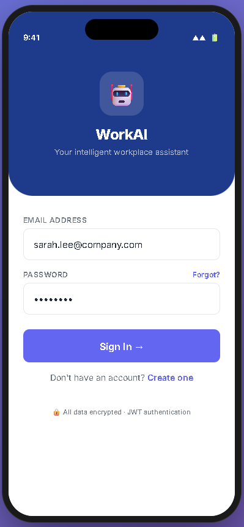
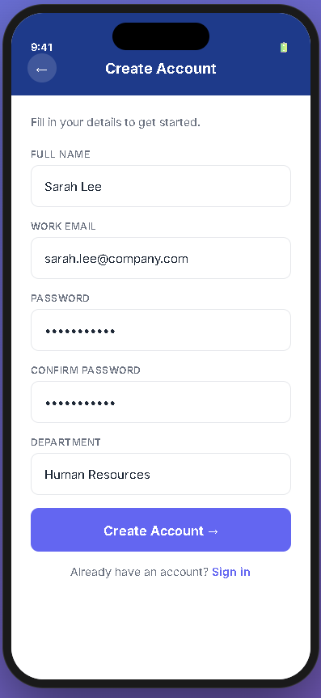
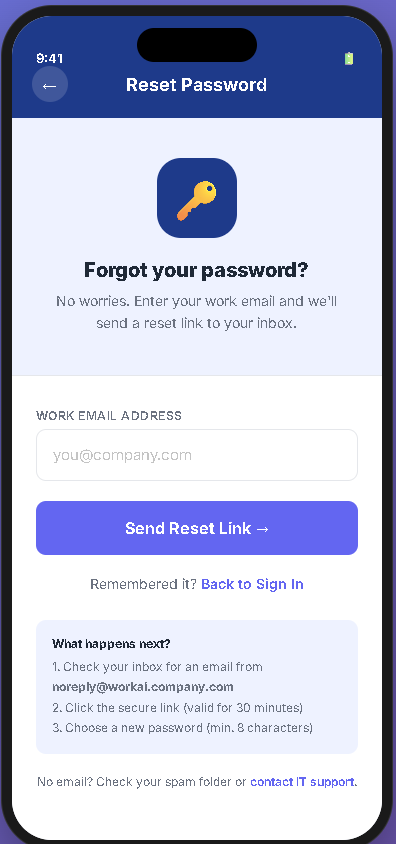
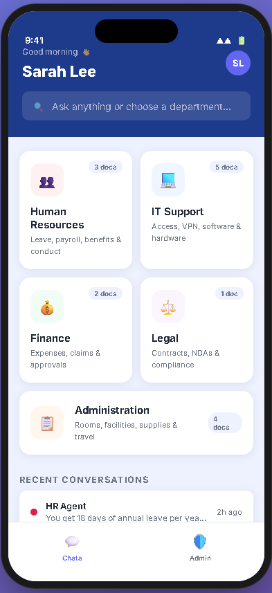
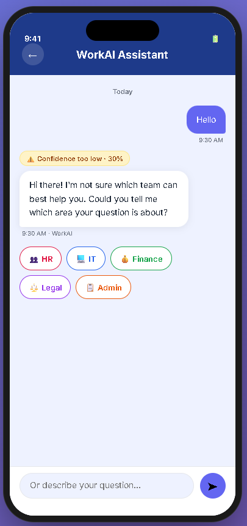
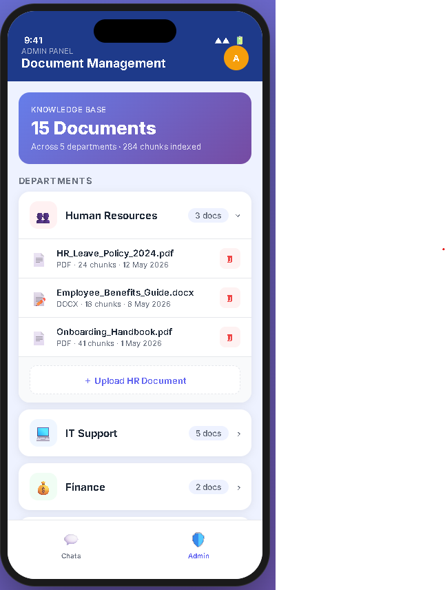
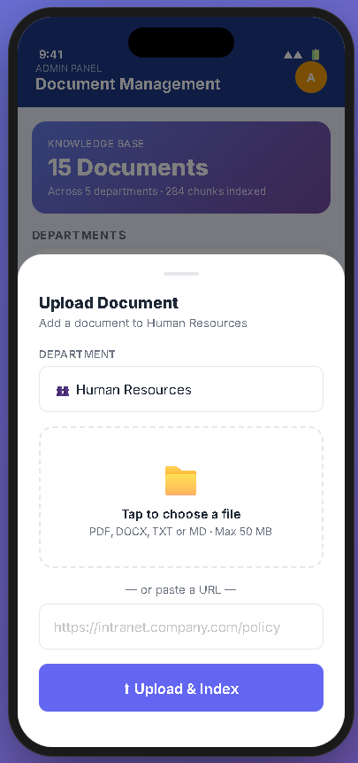

<div align="center">


# WorkAI — Enterprise AI Chatbot

**A mobile-first, multi-agent RAG chatbot for the modern workplace.**  
Employees ask questions in plain English. WorkAI intelligently routes each query to the right department agent, answers from real policy documents, and streams responses in real time.

[](https://python.org)
[](https://fastapi.tiangolo.com)
[](https://expo.dev)
[](https://github.com/facebookresearch/faiss)
[](https://ollama.ai)
[](LICENSE)

</div>

---

## App Screens

> Live interactive prototype → open [`docs/ui_prototype.html`](docs/ui_prototype.html) in your browser.

<table>
<tr>
  <td align="center" width="25%">
    <br/>
    <b>Login</b><br/>
    <sub>JWT auth · email + password</sub>
  </td>
  <td align="center" width="25%">
    <br/>
    <b>Register</b><br/>
    <sub>Department selection on sign-up</sub>
  </td>
  <td align="center" width="25%">
    <br/>
    <b>Forgot Password</b><br/>
    <sub>Email reset flow with step tracker</sub>
  </td>
  <td align="center" width="25%">
    <br/>
    <b>Home Dashboard</b><br/>
    <sub>5 department cards + recent chats</sub>
  </td>
</tr>
<tr>
  <td align="center" width="25%">
    <br/>
    <b>Chat</b><br/>
    <sub>Streamed answers with routing pill</sub>
  </td>
  <td align="center" width="25%">
    <br/>
    <b>Clarify</b><br/>
    <sub>Low-confidence → user picks dept</sub>
  </td>
  <td align="center" width="25%">
    <br/>
    <b>Admin Panel</b><br/>
    <sub>Document management per dept</sub>
  </td>
  <td align="center" width="25%">
    <br/>
    <b>Upload &amp; Index</b><br/>
    <sub>File or URL → auto-indexed</sub>
  </td>
</tr>
</table>

> **Screenshots not yet captured?**  
> Open [`docs/ui_prototype.html`](docs/ui_prototype.html) → use the screen buttons at the bottom → take browser screenshots → save to `docs/screenshots/screen-<name>.png`.

---

## What It Does

```
Employee types a question in the mobile app
        │
        ▼
 Primary Router Agent (Ollama LLM · JSON mode)
 Classifies query → picks department (confidence score)
        │
   If confidence < 50% → asks user to clarify
        │
   ┌────┴───────────────────────────────────┐
   HR     IT    Finance    Legal    Admin
   Agent  Agent  Agent    Agent    Agent
     │      │      │        │        │
   FAISS  FAISS  FAISS    FAISS    FAISS   ← one index per dept
        │
   Top-k chunks retrieved → injected into LLM prompt
        │
   Answer streamed token-by-token to mobile app
```

---

## Key Features

| Feature | Detail |
|---------|--------|
| **Smart routing** | LLM classifies free-text queries → routes to correct dept agent automatically |
| **Clarification flow** | Below 50% confidence → shows department selector buttons instead of guessing |
| **Streaming answers** | Server-Sent Events (SSE) — answer appears word by word, no waiting |
| **Multi-format ingestion** | Upload PDF, DOCX, TXT, Markdown, or paste a web URL |
| **Per-dept knowledge base** | Each department has its own FAISS index — no cross-contamination |
| **Admin panel** | Upload, view, and delete documents per department from the mobile app |
| **JWT authentication** | Stateless tokens — mobile-friendly, role-based (user / admin) |
| **Rate limiting** | 20 chat messages/min via SlowAPI — prevents abuse |
| **Grounded answers** | LLM is instructed to answer only from retrieved chunks — no hallucination |
| **Full chat history** | All sessions and messages persisted in SQLite |

---

## Tech Stack

<table>
<tr><th>Layer</th><th>Technology</th><th>Why</th></tr>
<tr><td>Backend API</td><td>Python 3.11 + FastAPI</td><td>Async, typed, auto-generates Swagger docs</td></tr>
<tr><td>Database</td><td>SQLite + SQLAlchemy ORM</td><td>Zero-config file-based DB, perfect for learning</td></tr>
<tr><td>Vector Store</td><td>FAISS (faiss-cpu)</td><td>Fast nearest-neighbour search, one index per dept</td></tr>
<tr><td>Embeddings</td><td>sentence-transformers (all-MiniLM-L6-v2)</td><td>90 MB, CPU-only, 384-dim vectors, no auth needed</td></tr>
<tr><td>LLM / Chat</td><td>Ollama (gpt-oss:120b-cloud)</td><td>OpenAI-compatible local server — free to run</td></tr>
<tr><td>Authentication</td><td>JWT (python-jose + passlib/bcrypt)</td><td>Stateless tokens, mobile-friendly</td></tr>
<tr><td>Rate Limiting</td><td>SlowAPI</td><td>Per-route limits without middleware overhead</td></tr>
<tr><td>Doc Parsers</td><td>pdfplumber, python-docx, beautifulsoup4</td><td>PDF, DOCX, TXT/MD, web URL support</td></tr>
<tr><td>Mobile App</td><td>React Native (Expo managed)</td><td>Cross-platform iOS + Android from one codebase</td></tr>
<tr><td>State Management</td><td>React Context + AsyncStorage</td><td>Auth session survives app restarts</td></tr>
<tr><td>HTTP Client</td><td>Axios with JWT interceptor</td><td>Auto-attaches Bearer token to every request</td></tr>
</table>

---

## Folder Structure

```
enterprise-chatbot/
├── README.md
├── .gitignore
│
├── docs/                          ← All documentation
│   ├── plan.md                    ← Master project plan + API map
│   ├── phase1.md  → phase9.md    ← Per-phase learning docs
│   ├── ui_prototype.html          ← Interactive app prototype (open in browser)
│   ├── screenshots/               ← App screen captures
│   └── help/                      ← End-user and deployment guides
│       ├── 01-dev-setup.md
│       ├── 02-hosting-linux-vps.md
│       ├── 03-hosting-windows-vps.md
│       ├── 04-publish-app.md
│       └── 05-testing.md
│
├── backend/                       ← Python FastAPI server
│   ├── main.py                    ← App entry point + lifespan
│   ├── .env                       ← Secrets (not committed — use .env.example)
│   ├── requirements.txt
│   │
│   ├── core/
│   │   ├── config.py              ← Typed settings loaded from .env
│   │   ├── security.py            ← bcrypt hashing + JWT encode/decode
│   │   ├── logging_config.py      ← Centralised logger, file output
│   │   └── rate_limit.py          ← SlowAPI Limiter singleton
│   │
│   ├── db/
│   │   ├── database.py            ← SQLAlchemy engine + get_db() dependency
│   │   └── models.py              ← User, Document, Chunk, Session, Message tables
│   │
│   ├── auth/                      ← POST /auth/register  /login  GET /auth/me
│   ├── chat/                      ← POST /chat/message  /query  GET /chat/history
│   ├── admin/                     ← POST/GET/DELETE /admin/documents
│   │
│   ├── ingestion/
│   │   ├── parsers.py             ← PDF/DOCX/TXT/URL → plain text
│   │   ├── chunker.py             ← Overlapping fixed-size chunking (500t / 50 overlap)
│   │   ├── embedder.py            ← sentence-transformers singleton
│   │   ├── vector_store.py        ← FAISS index per department
│   │   └── pipeline.py            ← Orchestrates full ingest (parse → chunk → embed → store)
│   │
│   ├── agents/
│   │   ├── prompts.py             ← Per-dept system prompts with grounding constraint
│   │   ├── query_engine.py        ← RAG pipeline: embed → retrieve → augment → stream
│   │   └── router_agent.py        ← LLM JSON-mode classifier → RoutingResult
│   │
│   └── vector_store/              ← FAISS .faiss files (not committed)
│       ├── hr/index.faiss
│       ├── it/index.faiss
│       ├── finance/index.faiss
│       ├── legal/index.faiss
│       └── admin/index.faiss
│
├── mobile/                        ← React Native (Expo) app
│   ├── App.tsx                    ← Auth-guard navigator switching
│   ├── theme.ts                   ← Design tokens (colors, typography, spacing)
│   ├── context/AuthContext.tsx    ← Global auth state + AsyncStorage persistence
│   ├── services/
│   │   ├── api.ts                 ← Axios singleton with JWT interceptor
│   │   └── chatService.ts         ← XHR SSE streaming, byte-offset buffering
│   ├── screens/
│   │   ├── LoginScreen.tsx
│   │   ├── RegisterScreen.tsx
│   │   ├── ForgotPasswordScreen.tsx
│   │   ├── HomeScreen.tsx
│   │   └── ChatScreen.tsx
│   └── components/
│       ├── MessageBubble.tsx      ← User/AI bubbles, routing pill, streaming cursor
│       └── TypingIndicator.tsx    ← 3-dot animated bounce (native driver, 60fps)
│
└── RAG_VENV/                      ← Python virtual environment (not committed)
```

---

## API Reference

| Method | Endpoint | Auth | Description |
|--------|----------|------|-------------|
| `GET` | `/health` | — | Health check — tests DB + Ollama connectivity |
| `POST` | `/auth/register` | — | Create new user account |
| `POST` | `/auth/login` | — | Login, returns JWT access token |
| `GET` | `/auth/me` | JWT | Current user profile |
| `POST` | `/chat/message` | JWT | **Primary chat** — router auto-picks department, SSE stream |
| `POST` | `/chat/query` | JWT | Direct dept chat — bypass router, SSE stream |
| `GET` | `/chat/history/{session_id}` | JWT | Fetch full message history for a session |
| `POST` | `/chat/session` | JWT | Create a chat session explicitly |
| `POST` | `/admin/documents/upload` | JWT + Admin | Upload file or URL → background ingest |
| `GET` | `/admin/documents` | JWT + Admin | List documents (optional `?department=hr`) |
| `GET` | `/admin/documents/{id}` | JWT + Admin | Single document detail (poll for chunk count) |
| `DELETE` | `/admin/documents/{id}` | JWT + Admin | Delete document + rebuild FAISS index |

**SSE Event Types** (from `/chat/message`):

| Event | Payload | Meaning |
|-------|---------|---------|
| `routing` | `{department, confidence, reason}` | Router has picked a department |
| `metadata` | `{session_id, chunk_count}` | RAG retrieval complete |
| `token` | `{text}` | Next streamed word from LLM |
| `done` | — | Stream complete |
| `clarify` | — | Confidence too low — prompt user to pick dept |

---

## Database Tables

| Table | Phase Added | Columns |
|-------|-------------|---------|
| `users` | 1 | id, email, hashed_password, full_name, role, department, created_at |
| `documents` | 2 | id, filename, department, file_type, chunk_count, created_at |
| `chunks` | 2 | id, document_id, chunk_text, chunk_index, faiss_id |
| `sessions` | 3 | id, user_id, department, created_at |
| `messages` | 3 | id, session_id, role, content, created_at |

---

## Departments

| Dept | Icon | Knowledge Base Covers |
|------|------|----------------------|
| Human Resources | 👥 | Leave policy, benefits, onboarding, conduct |
| IT Support | 💻 | VPN, access management, software, hardware |
| Finance | 💰 | Expense reimbursement, travel claims, approvals |
| Legal | ⚖️ | NDAs, contracts, compliance |
| Administration | 📋 | Facilities, meeting rooms, supplies, travel |

---

## Quick Start

### Prerequisites

- Python 3.11+
- [Ollama](https://ollama.ai) installed and running locally
- Node.js 18+ and npm (for mobile)
- [Expo Go](https://expo.dev/client) on your phone (for mobile testing)

### 1 — Clone and set up Python environment

```bash
git clone https://github.com/<your-username>/workai-enterprise-chatbot.git
cd workai-enterprise-chatbot

# Create and activate virtual environment
python -m venv RAG_VENV

# Windows
RAG_VENV\Scripts\activate

# Mac / Linux
source RAG_VENV/bin/activate

pip install -r backend/requirements.txt
```

### 2 — Configure environment

```bash
cp backend/.env.example backend/.env
# Edit backend/.env — set SECRET_KEY and OLLAMA_BASE_URL
```

```env
# backend/.env
APP_NAME=WorkAI
SECRET_KEY=your-super-secret-key-change-this
DATABASE_URL=sqlite:///./chatbot.db
OLLAMA_BASE_URL=http://localhost:11434
OLLAMA_MODEL=gpt-oss:120b-cloud
RATE_LIMIT_CHAT=20/minute
```

### 3 — Pull the LLM model

```bash
ollama pull llama3
# or whichever model you have — update OLLAMA_MODEL in .env
```

### 4 — Start the backend

```bash
cd backend
..\RAG_VENV\Scripts\python -m uvicorn main:app --reload --port 8000
```

API docs available at:
- Swagger UI → http://localhost:8000/docs
- ReDoc → http://localhost:8000/redoc
- Health → http://localhost:8000/health

### 5 — Run the mobile app

```bash
cd mobile
npm install
npx expo start
```

Scan the QR code with Expo Go, or press `w` for web browser preview.

---

## Running Tests

```bash
cd backend

# Phase 2 — Document ingestion pipeline
..\RAG_VENV\Scripts\python test_ingestion.py

# Phase 3 — RAG query engine
..\RAG_VENV\Scripts\python test_query_engine.py

# Phase 4 — Router agent (all 6 routing scenarios)
..\RAG_VENV\Scripts\python test_router_agent.py
```

Logs are written to `temp/<test_name>.log` alongside console output.

---

## Development Phases

This project was built in 9 learning phases. Each phase has a dedicated doc explaining **why** it exists, **what concepts** it teaches, and **the implementation logic** before any code.

| Phase | Name | Status | Key Concepts |
|-------|------|--------|--------------|
| 1 | Backend Foundation + JWT Auth | ✅ Done | FastAPI, SQLAlchemy, JWT, bcrypt |
| 2 | Document Processing + FAISS | ✅ Done | Embeddings, chunking, vector search |
| 3 | RAG Query Engine | ✅ Done | Semantic search, prompt engineering, SSE |
| 4 | Multi-Agent Router | ✅ Done | LLM-as-classifier, JSON mode, confidence thresholds |
| 5 | Admin Document API | ✅ Done | File upload, BackgroundTasks, RBAC, FAISS rebuild |
| 6 | React Native Auth Screens | ✅ Done | Expo, React Navigation, AuthContext, Axios |
| 7 | Chat UI + SSE Streaming | ✅ Done | FlatList, XHR SSE, optimistic UI, animations |
| 8 | Admin Panel UI | ✅ Done | expo-document-picker, FormData, role-based nav |
| 9 | Polish + Production Hardening | ✅ Done | Rate limiting, FAISS persistence, global error handler |

Full phase documentation → [`docs/`](docs/)

---

## Architecture Decisions

| Decision | Choice | Why |
|----------|--------|-----|
| **Embeddings model** | sentence-transformers (not Ollama) | Cloud Ollama model requires auth for `/api/embed` — local model avoids this |
| **Vector store** | FAISS (one index per dept) | Prevents cross-dept contamination; fast cosine similarity on CPU |
| **Routing strategy** | LLM JSON mode | Handles ambiguous queries naturally; extensible to new depts without code change |
| **Database** | SQLite | Zero config, file-based, perfect for learning and single-server deployments |
| **Streaming** | SSE (not WebSocket) | Simpler to implement; fits the request/response pattern of chat |
| **Auth** | JWT (stateless) | No server-side session storage; works seamlessly with mobile |

---

## Known Issues

| Issue | Details |
|-------|---------|
| `bcrypt` pinned to `4.0.1` | passlib is incompatible with bcrypt 5.x API — do not upgrade |
| Windows console encoding | `cp1252` can't display some LLM Unicode output — test scripts use `errors="replace"` |
| Ollama embed auth | Cloud model (`gpt-oss:120b-cloud`) returns 401 for `/api/embed` — sentence-transformers used instead |
| HuggingFace cache symlinks | Windows without Developer Mode shows cosmetic warnings — caching still works correctly |

---

## Help & Documentation

| Document | Content |
|----------|---------|
| [`docs/plan.md`](docs/plan.md) | Master plan — architecture, full endpoint map, DB schema |
| [`docs/phase1.md`](docs/phase1.md) → [`phase9.md`](docs/phase9.md) | Per-phase learning docs |
| [`docs/ui_prototype.html`](docs/ui_prototype.html) | Interactive HTML prototype of all app screens |
| [`docs/help/01-dev-setup.md`](docs/help/01-dev-setup.md) | Local development environment setup |
| [`docs/help/02-hosting-linux-vps.md`](docs/help/02-hosting-linux-vps.md) | Deploy backend to Linux VPS |
| [`docs/help/03-hosting-windows-vps.md`](docs/help/03-hosting-windows-vps.md) | Deploy backend to Windows VPS |
| [`docs/help/04-publish-app.md`](docs/help/04-publish-app.md) | Publish React Native app to App Store / Play Store |
| [`docs/help/05-testing.md`](docs/help/05-testing.md) | Testing guide |

---

## Contributing

1. Fork the repo
2. Create a feature branch: `git checkout -b feat/your-feature`
3. Follow the coding standards in [`docs/CODING_STANDARDS.md`](docs/CODING_STANDARDS.md) (logging mandatory, one class per file, docstrings required)
4. Commit: `git commit -m "feat: description of change"`
5. Open a Pull Request

---

## License

MIT © 2026 — Built as a learning project with phase-by-phase documentation.

---

<div align="center">

**WorkAI** · FastAPI + FAISS + Ollama + React Native  
Built phase by phase — every design decision documented.

</div>
